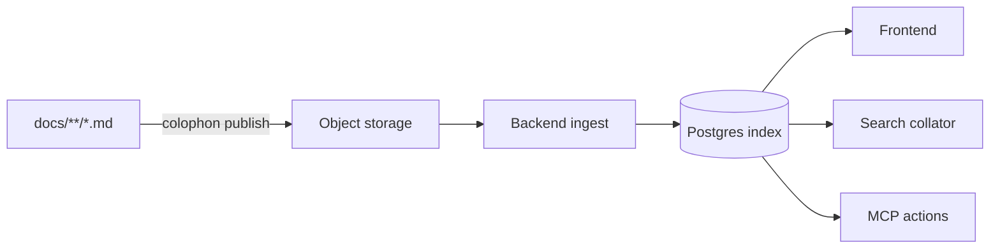

# Architecture

## The shape of the problem

TechDocs commits to HTML at build time. By the time Backstage sees the docs
the Markdown is gone, so theming becomes CSS patching of a foreign DOM inside
a shadow root, and anything agent-facing has to reconstruct meaning from
generated HTML.

Colophon keeps Markdown as the canonical stored artifact and renders at the
edges. Theming flexibility and agent exposure stop being two hard problems and
become two consumers of one structured source.

## Pipeline

## Two storage systems

Split by artifact type, because they have opposite properties.

| | Object storage | Postgres |
| --- | --- | --- |
| Holds | markdown, images, attachments | manifest, nav, pages, chunks, channels |
| Why | large, immutable, content-addressed, cheap | small, relational, constantly queried |

Content-addressing is what makes retained history affordable. A release branch
differing from `main` by three pages stores three blobs, not a second copy of
the corpus.

## Revisions and channels

A **revision** is an immutable snapshot identified by the sha-256 of its
manifest. A **channel** is a mutable named pointer such as `latest`, `1.x`, or
`pr-42`. CI publishes a revision, then repoints a channel at it.

Keeping routing out of the manifest is what makes rollback a pointer move
rather than a rebuild, and lets identical content dedupe across channels.

Only channel-pointed revisions are indexed, and only the default channel
projects into Backstage Search — otherwise the portal search box returns the
same page once per version.

The two consumers of a chunk want it in different forms, and the projection
is where they diverge. Agents get the stored markdown, because a table is
worth more than a flattening of it, and an absolute URL, because they have no
app to be inside. The portal gets plain text, because raw source puts table
pipes and backticks in front of a reader, and an app-relative path, because
Backstage renders results with a router-aware link that sends an absolute URL
to a new browser tab.

## Chunking lives in the backend

Retrieval chunks are cut at index time, not at publish time. Chunking strategy
will evolve as we learn what agents retrieve well, and re-chunking must never
require every repository to re-run its CI.
