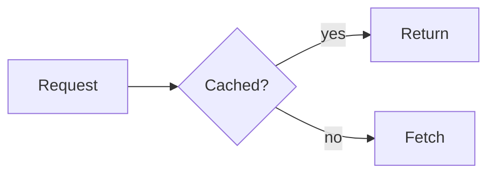

# Writing documentation

## Layout

```
docs/
  index.md          required, the entry point
  **/*.md           nesting is fine
  _assets/          images and attachments
  docs.yaml         optional: explicit nav and overrides
```

Navigation is derived from the directory tree unless `docs.yaml` provides an
explicit `nav`. Requiring a nav file is the biggest onboarding tax in MkDocs,
so it stays optional.

## docs.yaml

Every field is optional, and so is the file.

```yaml
title: Payments docs      # overrides the title taken from the root page
description: One line about this bundle.
defaultType: reference    # type for pages whose frontmatter omits one
exclude:                  # globs, relative to the docs root
  - drafts/**
nav:                      # when present, wins over the directory tree
  - title: Guides
    children:
      - page: guides/deploy.md
```

A misspelled key is an error rather than a silent no-op — `navigation:` instead
of `nav:` used to mean a carefully ordered nav simply never applied, on a green
build.

Two things about `exclude` are worth knowing before you write one:

- Patterns are relative to the docs root, so a **leading slash matches
  nothing**: `/drafts/**` publishes the drafts, `drafts/**` withholds them.
- A pattern that matches no files is reported as a warning, and under
  `--strict` it fails the build. A shared `docs.yaml` copied across components
  will trip this in the components that have no `drafts/` — either drop the
  pattern there or do not run those publishes with `--strict`.

## Frontmatter

```yaml
---
title: Rotating database credentials
description: One sentence describing what this page answers.
type: how-to          # tutorial | how-to | reference | explanation
tags: [database, security]
status: current       # current | draft | deprecated
---
```

Only `title` is strictly required, and even that falls back to the first H1.

## Two fields that carry more weight than they look

**`description`** is what an agent sees in a search result before deciding
whether to fetch the whole page. A weak description means the agent fetches
everything and burns its context. `--strict` makes a missing description a
build failure — along with every other advisory: an orphaned page, a bundle
with no landing page, an exclude pattern that matches nothing.

**`type`** uses the [Diátaxis](https://diataxis.fr) categories. It groups the
UI, lets agents filter for the right kind of page, and nudges you toward one
purpose per page — which is what makes sections self-contained.

## Write sections that survive being read alone

Retrieval cuts pages into chunks at H2 and H3. Every section is retrieved
without its neighbours, so:

- Say "OAuth 2.0 authentication", not "the authentication method above".
- Avoid pronouns that point at the previous section.
- Keep one complete thought under each heading.

This matters more to retrieval quality than any ranking algorithm. A
well-chunked corpus with plain full-text search beats a badly-chunked one with
state-of-the-art embeddings, because a chunk that does not stand alone is
useless no matter how well it was retrieved.

## Diagrams

Fenced `mermaid` blocks render as diagrams, in both light and dark themes.

````markdown

````
